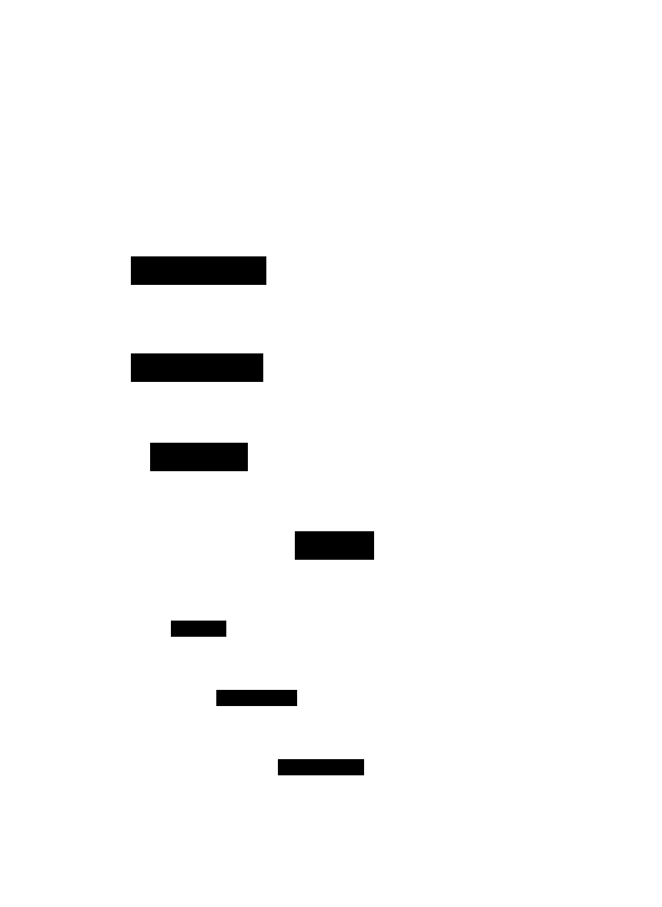

# TSSH
*tssh* manages [TPM](https://trustedcomputinggroup.org/resource/tpm-library-specification/)-backed keys that are ready to use with *ssh*.
Its main focus is to be as stateless as possible by leveraging the fact that TPMs can derive keys deterministically.
By default, TSSH uses the username, hostname and port as the salt for key derivation, thereby ensuring that each host has a unique public key. Furthermore, TSSH ensures that the SSH server is offered only the correct key.
Check further down for detailed diagrams.

## Prerequisites

Make sure you have installed the following libraries:

 - SQLite3
 - Tpm2-tss.
 
 Furthermore, the binary must be allowed to use the TPM. This is typically achieved by adding the user to the TSS group.


## Install 

Execute the following from the project route:


 ```console
cargo install --path ./tssh/ --locked
 ```

## Nix tests


 ```console
nix flake check -L
 ```


## Example usage

Add the output of the following command to your *~/.ssh/config* file: 


```console
localhost $> tssh include

```

Alternatively, if you don't mind losing your current configuration, you could simply run the following command:


```console
localhost $> tssh include -q > ~/.ssh/config

```

You can now create an SSH public key using the following command:

```console
localhost $> tssh create user@example.com
```

Please note that the above command may take several seconds to execute the first time it is run. This is because it tests which algorithms your TPM supports. Subsequent runs retrieve this information directly from the configuration stored in the SQLite database.

Type in the following command to extract the public key, which is ready to use:


```console
localhost $> tssh get example.com
========== Key for user@example.com:22 =========

ecdsa-sha2-nistp384 AAAAE2 .........
```

Once you have informed example.com of the public key (e.g. by adding it to the authorised_hosts file), you can simply use SSH to log in:


```console
localhost $> ssh user@example.com

user@example.com $>
```

# Diagrams

## Architecture
<div style="width: 100%;">
  
</div>

## Key Creation
<div style="width: 100%;">
  
</div>

## SSH Login
<div style="width: 100%;">
  
</div>

# Features planned
* [ ] Key import
* [ ] Keys with pin
* [ ] Keys bound to hardware state (via PCR) 
* [ ] Bundled builds
* [ ] Minimal build for better container support 
* [ ] Backup key propagation
* [ ] Backup key login (with different backends: plain, bitwarden,.. etc.)
* [ ] Commandline completion
* [ ] Apple secure enclave support

# License

The software is provided under GPLv3. Contributions to this project are accepted under the same license.
